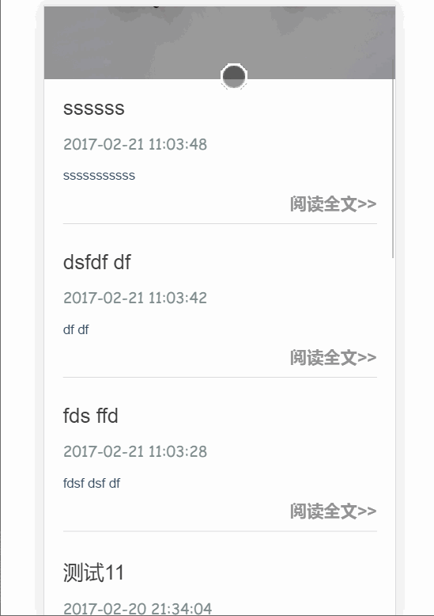

> 一个前端基于Vue2.0全家桶，后端基于Express+Mongodb的前后端分离博客。前端界面使用了flexbox+rem布局，后端界面使用了element ui。本项目可以作为一个前端进阶项目，从前端flexbox布局到前端框架的使用，再到后端以及数据库，是一个打通前后端流程的一个项目。由于最近刚换了域名，正在备案中，所以目前没有线上演示，不过可以看一下下面的动态图特效。  

#  特点
* 支持 MarkDown 编辑
* 支持代码高亮
* 支持移动端浏览

[在线地址](http://www.dailu.site)

# 功能展示展示


#### PC前台博客演示


#### 移动端前台演示


#### 后台管理演示


#### 若图片无法显示则点击这里:[pc前端功能展示](http://ofyxyx8o9.bkt.clouddn.com/fronted.gif) [移动前端功能展示](http://ofyxyx8o9.bkt.clouddn.com/mobile.gif)[pc后端功能展示](http://ofyxyx8o9.bkt.clouddn.com/backend.gif)

### 前端工具
* Vue2.0
* Vue-Router
* Vuex
* axios
* element ui  

前端布局采用flexbox+rem布局，关于flexbox请阅读[一个完整的Flexbox指南](http://www.w3cplus.com/css3/a-guide-to-flexbox-new.html)以及这篇最新的[理解Flexbox：你需要知道的一切](http://www.w3cplus.com/css3/understanding-flexbox-everything-you-need-to-know.html)

本项目还采用了手机端适配，关于移动端的学习资料请按照我下面罗列的资料按顺序仔细阅读。

1. [移动端调试](https://segmentfault.com/a/1190000002565572)
2. [介绍vieport](http://www.css88.com/archives/6410)
4. [使用Flexible实现手淘H5页面的终端适配](https://github.com/amfe/article/issues/17)


### 后端工具
* express
* mongodb（mongolass）

后端的管理界面我直接使用了[element ui](http://element.eleme.io/#/)这个基于vue的组件库，很强大.


# 目录结构

```
│  .babelrc
│  .editorconfig
│  .eslintignore
│  .eslintrc.js
│  .gitignore
│  index.html
│  package.json
│  README.md
│
├─build
│      build.js
│      check-versions.js
│      dev-client.js
│      dev-server.js
│      utils.js
│      webpack.base.conf.js
│      webpack.dev.conf.js
│      webpack.prod.conf.js
│
├─config
│      dev.env.js
│      index.js
│      prod.env.js
│      test.env.js
│
├─server                        后端文件夹
│  │  .env
│  │  app.js    后端入口
│  │
│  ├─api
│  │      index.js  后端api
│  │
│  ├─lib
│  │      mongo.js 数据库
│  │
│  ├─middleware
│  │      checkToken.js
│  │      createToken.js
│  │
│  └─routes                 后端路由
│          admin.js
│          article.js
│          classify.js
│          index.js
│          login.js
│          reg.js
│
├─src       前端文件夹
│  │  App.vue
│  │  main.js   前端入口
│  │
│  ├─api    前端api
│  │      index.js
│  │
│  ├─assets
│  │  ├─css
│  │  │      commen.css
│  │  │      default.css
│  │  │      default0.css
│  │  │      highlight.css
│  │  │
│  │  ├─img
│  │  │      bg.jpg
│  │  │      bgm.jpg
│  │  │
│  │  └─js
│  │          commen.js
│  │          highlight.pack.js
│  │          hljs.js
│  │
│  ├─components
│  │  │  NotFound.vue
│  │  │
│  │  ├─backEnd             后端界面
│  │  │      Admin.vue
│  │  │      ArticleCreate.vue
│  │  │      ArticleEdit.vue
│  │  │      ArticleList.vue
│  │  │      ClassList.vue
│  │  │      Login.vue
│  │  │      Reg.vue
│  │  │
│  │  └─fronted             前端界面
│  │          About.vue
│  │          Article.vue
│  │          Front.vue
│  │          Home.vue
│  │          Tags.vue
│  │          vfooter.vue
│  │          vheader.vue
│  │
│  ├─routes             前端路由vue-router
│  │      index.js
│  │      routes.js
│  │
│  └─store             前端vuex
│      │  actions.js
│      │  index.js
│      │  MsgAlert.js
│      │  mutations.js
│      │  states.js
│      │  types.js
```  

## Step
#### 环境
* Node.js v6
* mongoDB [下载地址](https://www.mongodb.com/download-center?jmp=nav#community)
[安装方法](https://docs.mongodb.com/manual/installation/)
安装完成后启动数据库  
`mongod`  


#### 克隆远程库
`git clone https://github.com/elva2596/vueBlog.git`


#### 安装前端依赖
`npm install`


#### 全局安装supervisor
`npm install -g supervisor`


#### 启动mongodb服务器

在你安装的数据库文件中的bin目录中启动

`mongod`

#### 安装后端依赖
`进入到server文件夹下，安装后端依赖：npm install`

#### 启动后端服务器
`npm start`


#### 启动前端项目
`回到项目根目录下运行：npm run dev`


#### 生成发布
`npm run build`


#### Notice
* 前后端启动时的路径不一样，前端在项目根目录，后端在servser根目录，其实可以把后端分离出来。
* 因为是前后端分离项目，必然涉及到跨域，使用webpack的proxyTable,进入到config文件夹的index.js,将proxyTable配置成：
`proxyTable: {
        '/api':{
        target:'http://localhost:3009/api',
        changeOrigin:true,
        pathRewrite:{
          '^/api':''
        }
      }
    },`


* 推荐[Robomongo](https://robomongo.org/)作为数据库的可视化管理工具
* 推荐Postman作为验证restful API的工具，请参考[这篇文章](http://www.cnblogs.com/mafly/p/postman.html)
* 这里的主页界面有个小小的bug,主页只显示每篇具体文章的摘要，在这里我取了一个巧，就是将从后端返回的数据经过markdown解析以后，用了一个正则把第一个p标签以及其中的内容给提取出来渲染到页面。因此后端在添加文章的时候必须在编写每篇文章的开头写一段话。因为毕竟这个博客只是一个第一版，后面我会把这个问题解决掉。


# Todo
* 移动端优化，300ms
* 添加评论功能
* 密码修改功能
* 用户权限分类


# 更改数据库,兼容mysql
由于我在打开后端时,mongodb在mac上不太好使用的情况下,
想使用mysql兼容数据库
使用 sequelize  重构  server/api/index.js

### todo
后端数据库分页请求有问题